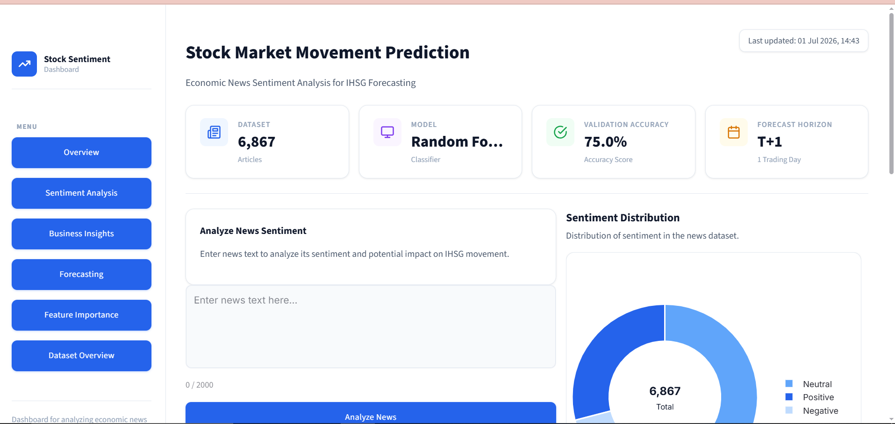
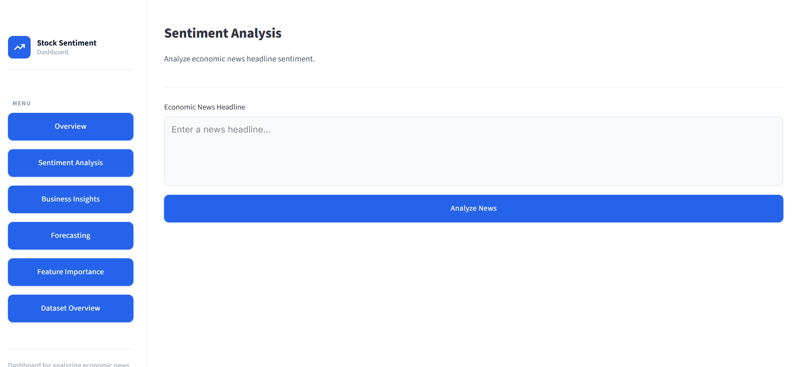
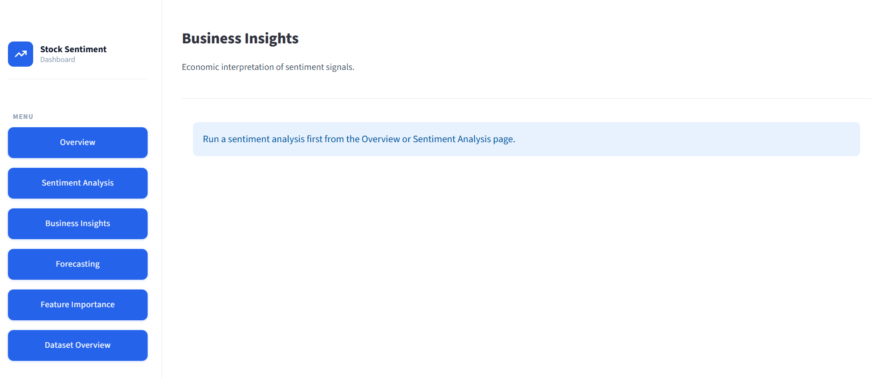
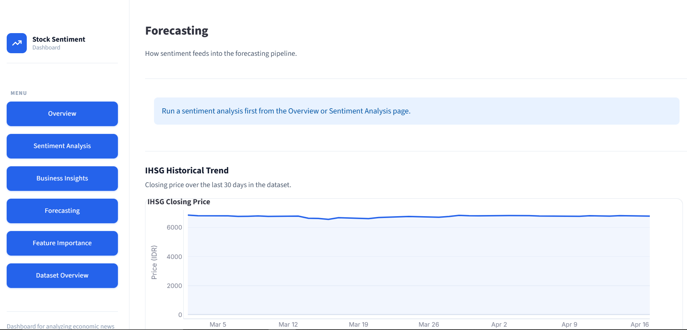
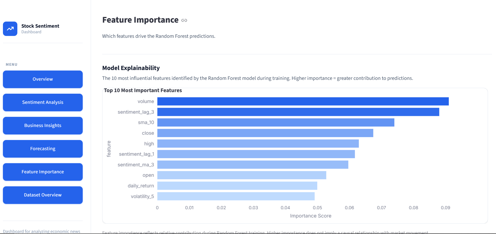
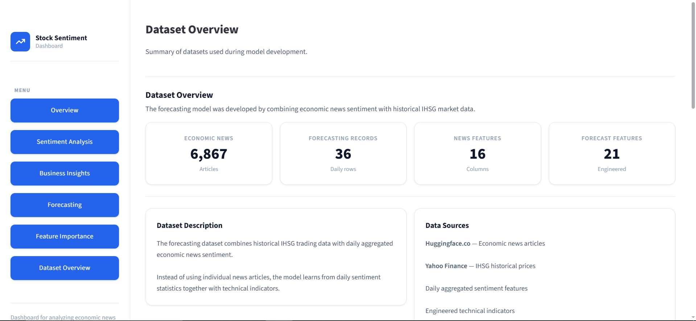

# IHSG Direction Forecasting Using Economic News Sentiment and Technical Indicators


An end-to-end Machine Learning project that predicts the next trading day's IHSG (Jakarta Composite Index) direction by combining economic news sentiment with technical market indicators. The project includes data preprocessing, feature engineering, model training, and an interactive dashboard built with Streamlit.

---

## Project Overview

Financial markets are influenced not only by historical price movements but also by economic news and investor sentiment. Traditional forecasting models often rely solely on technical indicators and overlook textual information that reflects market expectations.

This project integrates sentiment extracted from Indonesian economic news with historical IHSG market data to improve next-day market direction forecasting.

The complete pipeline consists of:

- Economic news collection
- Rule-based sentiment analysis
- Daily sentiment aggregation
- Technical indicator engineering
- Random Forest classification
- Interactive dashboard for prediction and visualization

---

## Medium Article

Read the full project explanation here:

> 🔗 https://medium.com/@chalimasadiah_21544/can-economic-news-predict-the-stock-market-building-an-end-to-end-ml-pipeline-for-ihsg-forecasting-28624649a282

---

## Business Problem

Investors and analysts continuously monitor large volumes of financial news before making investment decisions.

However:

- Reading hundreds of news articles every day is inefficient.
- Market reactions are influenced by both sentiment and technical market conditions.
- Combining structured market data with unstructured news data remains a challenge.

This project aims to provide a decision-support tool by integrating both information sources into a machine learning forecasting model.

---

## Dashboard Preview

> Screenshots will be added after deployment.

| Section  | Description                                  |
| -------- | -------------------------------------------- |
| Overview | Summary of key metrics and model performance |


| Sentiment Analysis | News classification and daily sentiment distribution |


| Business Insight | Practical takeaways for investors |


| Forecasting | Next-day IHSG direction prediction interface |


| Feature Importance | Which features influence the model the most |


| Dataset Overview | Summary of training and validation data |


---

## Machine Learning Pipeline

```
Raw Economic News
        │
        ▼
Sentiment Analysis (Rule-Based)
        │
        ▼
Daily Sentiment Aggregation
        │
        ▼
Historical IHSG Data (Yahoo Finance)
        │
        ▼
Technical Indicator Engineering (MA, RSI, MACD)
        │
        ▼
Feature Selection
        │
        ▼
Random Forest Classifier
        │
        ▼
Next-Day IHSG Direction Prediction (Up / Down)
        │
        ▼
Interactive Dashboard & Business Insight
```

---

## Dataset

The datasets are excluded from this repository due to GitHub's file size limitations.

Please place the datasets inside:

```
data/raw/
data/interim/
data/processed/
```

Or regenerate them using the preprocessing notebooks.

**Data Sources:**

| Source                                                                                  | Content                                                            |
| --------------------------------------------------------------------------------------- | ------------------------------------------------------------------ |
| [Huggingface.co](https://huggingface.co/datasets/fahadh4ilyas/indonesian_news_datasets) | ~6,800 Indonesian economic news articles                           |
| [Yahoo Finance](https://finance.yahoo.com)                                              | Historical IHSG daily market data (Open, High, Low, Close, Volume) |

---

## Features

- Economic News Sentiment Analysis
- IHSG Direction Prediction (Up / Down)
- Technical Indicator Visualization
- Feature Importance Analysis
- Historical Market Trend Visualization
- Interactive Dashboard
- Dataset Overview
- Business Insight Summary

---

## Model Performance

| Model                          | Accuracy  |
| ------------------------------ | --------- |
| Logistic Regression (Baseline) | 37.5%     |
| **Random Forest**              | **75.0%** |

> The Random Forest classifier correctly predicted the next-day IHSG direction approximately **3 out of every 4 times** on the validation set.

---

## Tech Stack

| Category         | Tools                       |
| ---------------- | --------------------------- |
| Language         | Python 3.12                 |
| Machine Learning | Scikit-learn, Pandas, NumPy |
| Visualization    | Plotly, Matplotlib          |
| Dashboard        | Streamlit                   |
| Version Control  | Git, GitHub                 |

---

## Installation

**1. Clone the repository**

```bash
git clone git@github.com:chalimasadiah/stock-sentiment-prediction.git
cd stock_sentiment_prediction
```

**2. Create a virtual environment**

```bash
python -m venv .venv
source .venv/bin/activate        # Mac / Linux
.venv\Scripts\activate           # Windows
```

**3. Install dependencies**

```bash
pip install -r requirements.txt
```

**4. Run the dashboard**

```bash
streamlit run dashboard/app.py
```

---

## Project Structure

```
stock_sentiment_prediction/

├── dashboard/
│   ├── app.py
│   ├── components/
│   ├── assets/
│   └── services/
│
├── data/
│   ├── raw/
│   ├── interim/
│   └── processed/
│
├── models/
│
├── notebooks/
│
├── requirements.txt
│
└── README.md
```

---

## Current Limitations

This version focuses on demonstrating the end-to-end machine learning workflow.

Current limitations include:

- Rule-based sentiment analysis (no language model yet)
- Static historical dataset (no automatic updates)
- No real-time news ingestion
- Random Forest as the baseline model
- Predicts market direction only, not price magnitude

---

## Future Improvements

### Version 2

- Historical Simulation Mode (backtesting)
- Live Prediction Mode using recent news
- Real-time market data integration
- Automatic technical indicator generation

### Version 3

- IndoBERT-based sentiment classification
- Improved NLP preprocessing

### Version 4

- Additional macroeconomic indicators (USD/IDR, Gold Price, Oil Price, BI Rate)

### Version 5

- Model comparison (LightGBM, XGBoost, CatBoost)

### Version 6

- Explainable AI (SHAP)
- FastAPI backend
- Next.js frontend
- Docker containerization
- Cloud deployment

---

## Current Project Status

| Item            | Details                              |
| --------------- | ------------------------------------ |
| Current Version | v1.0                                 |
| Status          | Completed — Baseline Implementation  |
| Next Milestone  | v2.0 — Live Prediction & Backtesting |

---

## References

- [Yahoo Finance](https://finance.yahoo.com)
- [Huggingface.co](https://huggingface.co/datasets/fahadh4ilyas/indonesian_news_datasets)
- [Scikit-learn Documentation](https://scikit-learn.org)
- [Streamlit Documentation](https://streamlit.io)
- [Plotly Documentation](https://plotly.com)
- Breiman, L. (2001). Random Forests. _Machine Learning_, 45(1), 5–32.

---

## License

This project is licensed under the [MIT License](LICENSE).

---

## Acknowledgement

Built as the final project for the **Pacmann Machine Learning Program**.

---

## Author

**Chalima Sadiah**

Aspiring Machine Learning Engineer passionate about developing AI-driven solutions for forecasting and decision support systems.

[](https://github.com/chalimasadiah)
[](https://www.linkedin.com/in/chalimasadiah/)
[](https://medium.com/@chalimasadiah_21544)

> Feel free to connect or provide feedback about this project.
